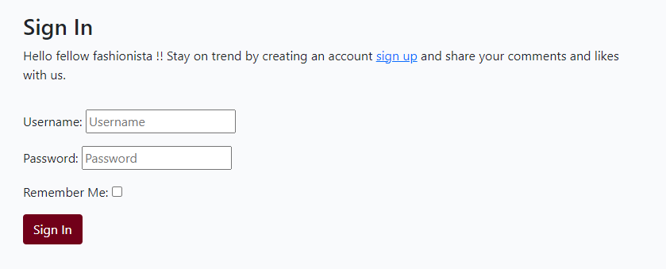
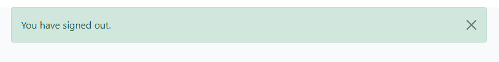
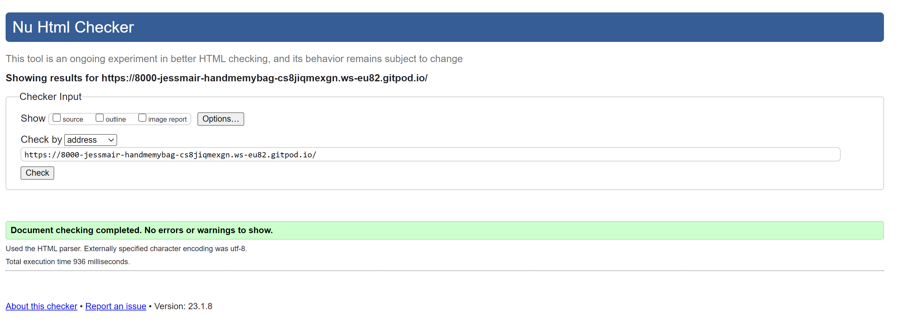

# Hand Me My Bag - A Django Project

This is my fourth milestone project, undertaken as part of the Code Institutes Diploma in Software Development.
Here is the link for [Hand Me My Bag](https://handmemybag.herokuapp.com/)

#  Who Is This Website For?
Hand Me My Bag is a dedicated blog site for handbag enthusiasts. The idea behind the blog is to present high-end luxury handbags, yet to share the blog authors opinions of the bag. The site visitors are also welcomed to engage in the conversation about the bag by leaving their comments and rating of the bag. 
The site user can also contact the blog author using the contact us page. The blog site is a place for gaining exposure, knowledge, and engagement all whilst sharing a passion for high end luxury handbags. 

# UX - User Experience 

The project was planned in 5 stages. 

- Strategy Plane 

- Scope Plane 

- Structure Plane

- Skeleton Plane

- Surface Plane 

## The Strategy Plane 

## User Persona

This website is targeted predominately towards women and some men who are luxury handbag enthusiasts. 

The focus of this site has been to provide a clean aesthetic to the site, with ease of navigation.
The site has been designed to be responsive when displayed on different size devices. 

## User Goals 
### Unregistered
- View the posts on the website 
- Send a message to the site admin

### Registered (the above and plus+)
- Like posts
- Create and View own comment on the post 
- Update and Delete own comment on the post  
- Leave, View, Edit or Delete own rating on a post

### Site Owner Goals
- Create, View, Update and Delete posts
- Approve or Disapprove comments/ratings from users
- Delete comments/ratings on the site
- Blank forms are not sent ("contact us" form)
- Have a site that is easy and smooth to navigate and learn so that viewers will return in the future to view and engage in more content. 

## User Requirements and Expectations 
### Requirement
- Easy to navigate 
- Content on post are relevant to the purpose of the blog
- Aesthetically appealing website
- Easy to locate interactive features of the site such as "logout". 

### Expectations 
- Expect that the navigation links work properly to take the user where they intended to go.
- Expect to be able to successfully leave, update or delete a comment (If logged in).
- Expect feedback when user registers, logs in, logs out
- Expect feedback when user writes, edits, or deletes comments

## User Stories
These stories have been assigned Low, Medium, or High next to the story to clarify which order the stories are to be prioritized in. 

### Unregistered User
-   As a user I want the site to be easy to navigate - Medium
-   As a user I want to be able to open and view posts - High
-   As a user I want to view other site visitors’ comments - Medium
-   As a user I want to be able to register an account with the site and for this process to be easy - High
-   As a user I want to be able to send a message to the site owner - Low

### Registered User (the above and plus+)

-   As a user I want to be able to like and unlike posts - Low
-   As a user I want to be able to leave, update and delete my own comments - High
-   As a user I want to be able to leave a rating review of the post/bag - Low
-   As a user I want the site to be clutter free and only contain information that serves the blogs purpose - Medium

## Site Admin 

-   Owner should be able to log into account - High
-   Owner should be able to create, display, update and delete post - High
-   Owner Should be able to approve or delete all comments, whether new or previous - High
-   Owner should be able to retrieve the details of the contact us form submitted by site visitors - Medium
-   Owner should be able to retrieve messages sent via contact us form - Low

## Agile Methodology 
- This application was developed using Agile Methodology. The design and implementation was planned based on user stories and a project board. This project board has a series of user stories that were split into 3 categories: to-do, in progress or done. This project board was made using GitHub projects. When working with agile as methodology, priority is given to the most important aspect of the project and therefore the scope is limited based in the amount of time one has as quality of the development needs to be maintained. There were features I was not able to implement, I have listed them under "future implementation" in the read me.
Here is a link to my [ProjectBoard](https://github.com/users/JessMair/projects/6/views/1)

# The Scope Plane

The features of this project:

5 pages /
- Home, Register, Login, Logout, Contact Us
- Pagination 
- Posts 
- Comments from other site visitors displayed 
- Comments form for registered user to submit 
- Contact us form for all site visitors to complete and submit 
- Crud functionality (Create, Read, Update and Delete) - Applied to the comments model
- Success messages (Successfully register, login, logout, update comment, delete comment or post comment)

# The Structure Plane 

## Design Thinking 
Here the features and functions of the site are detailed. I have tried to keep the design as uniform and consistent where possible 
### Blog Features 

- Title header - Emphasize the blog name with a tagline attached that quickly clarifies that it is a blog dedicated to luxury handbags. The title is also responsive. 

- Navbar - Responsive and navigates to the Home page, Login or Logout, Register and Contact Us pages. 

- Home page - This is the landing page. I have tried to keep the site clean and free from over congestion of images or words. The idea behind this is for the page to present as visually appealing to the site user. 

- Register, Login and Logout

All button change colour when hovered over with a mouse.

- Site Pagination - Each page displays up to 6 posts 

- Comments form - Visible under the full post for a logged in user to leave a comment 

- Comments section for users who are not logged in will not display the form to input. Instead, they are given a link to follow to sign in. 

- Edit and delete buttons to allow site user to update and delete their own comments only. 

- Process of updating a comment 
The User can update their comment and the rating which they have given. 
They can also delete their comments too and are asked to confirm this option. 
The comments whether new or updated are approved or disapproved in the admin panel. 

- Posts - The blog posts have an image of the bag, its name, the date the post was created, and an excerpt. The full post contains the actual blog about the bag. 

- Post when opened - A title of the bag followed by a blog and comments section at the bottom. 

- Contact Us form - A simple form that contains a name, subject and message field to enable even a non registered site visitor to get in touch.

 

- Likes - A small heart which is clear but turns a blush pink colour when the site user clicks on it. 

- Favicon 
I decided to use a premade favicon of a handbag. I wanted something bright that would stand out on the tab bar. 

 

- Success messages 

When an authorised User posts a comment, they will get this message:

 

When an authorised User wants to delete their own comment, they will see this message:

 

When an authorised User wants to login or register, they will see this message:

 

When an authorised User wants to logout, they will see this message:

 

When an authorised User wants to update their own comment, they will see this message:

 

# The Skeleton Plane 

The design of this project was to make a soft and attractive application. One that is easy to navigate and that has lots of potential for growth in the future. 

Below is a link to the original wireframe I had completed

[wireframe1](media/wireframe1.jpg)

[wireframe2](media/wireframe2.jpg)

[wireframe3](media/wireframe3.jpg)

I made some changes towards the end in the interest of a blog that looks cleaner. I removed the hero image and instead opted to enlarge the blog title with the tagline in it's place and have the navbar sit directly below. This hange was mirrored throughout all the pages of the site. The rest of the design has remained consistent with what was orginally planned.  

# Surface Plane 
## Design Tools / Colour Palette
- Canva

I used Canva to finalise on a colour theme for the blog. I wanted the predominant colour themes to be complimentary of each other. 
As most blog visitors are likely to be women, I wanted to infuse a more feminine touch to the site. The easiest way to do so was by using colours that are more reminiscent of femininity. These hues of red, brown, and pink are great for contrasting against one another and whilst embodying refinement. 

# Testing 
- CSS test  - passed.

- I also completed a HTML test - 
There were 2 repeating issues showing up and 1 unique issue. 
1. Warning requesting me to set the language in HTML, which i did set to english. This error was still showing up. 
2. Info - informing me the text trailing contains whitespace. I serached the exact error on my gitpod workspace and no files were returned. Therefore I am having to put this error down to a bug as the issue does not exist in my files. 
3. Error stating that an image tag i have used requires an alt attribute. However the lines in question are generated by the link to cloudinary and not code that I can manipulate, therefore I have had to ignore this error too. 

- [CI Python Linter](https://pep8ci.herokuapp.com/) - all passed 

## Bugs 
There were a multitude of bugs when developing this project. Below are some examples of the bugs I encountered. 

- After I had added the review module, I encountered error with accessing the admin site and the main site. After examining the code and error message, it turned out to be a case of not having used a capital letter. This was fixed and the site (both main and admin) ran without issue. 

- Leaving comments - error - after enabling the functionality to leave a comment and press submit. Checked Django documentation - line 49 of views.py file had the attribute of name given instead of "username".

- Error flagging once comment is approved through the admin panel. 
The issue was on line 24 of admin.py file. Should have said "approved" but I had instead typed "approve". This error was fixed. 

- The images are not resized and displayed appropriately when the blog is opened. This is an error that needed to be fixed. However due to a shortage of time, and it not being the most important thing on the list, this will need to be fixed in the next phase as per agile working methodology. 

- There was an issue where a user would be able to edit or delete another users comments. This was resolved by restricting the unauthorised users view to the edit and delete buttons unless the object (comment) they were viewing is linked to their profile. This resolved the issue. 

## Manual Testing 
- Test all links in Navbar work 

- Test site pagination works 

- Test that the 'like' feature worked 

- Test a Post Model: 
Posts can be created, displayed, updated, and deleted 
Check the full post can be read by clicking on the post name

- Test Comments Model: 
User needs to be logged in to leave a comment
Comments can be created by the user
The comment displays 
The comment can be updated 
The comment can be deleted 
Comments once submitted need to be approved 
The user can update and delete their own comments only

- Contact Model
Anyone can submit the 'Contact Us' form
The form will not submit if any of the fields are empty
The form requires the email field to have an email in it to be submittable 

# Technologies used 
### Languages
- HTML5
- CSS 3
- Python 
- HTML
- CSS

### Frameworks
- Django
- Bootstrap

### Databases
- PostgreSQL

### Django Extensions
- All AUTH
- Summernote 
- Django Crispy Forms 

### Cloud Storage and Deployment Services 
- Cloudinary
- Heroku
- Gunicorn

# Future implementation 
- Single sign on using allauth:
Using social media to sign in to the blog would make the user experience better and encourage more traffic to the site. 

- Design:
I would like to make the blog more visually aesthetic, I have a few ideas in mind for this. I would make the integer rating under the comment form into stars and this change would reflect on the already rated comments. This would look more presentable. 

The login and sign out pages would also be targeted by bootstrap to look more in line with the rest of the blog. I did make a start on this, but I did not have time to complete this. 

- Search functionality 
As the number of blogs increase, I will implement a search bar to search designers. This will return all the posts by that particular designer. 

- Apps:
In future I would like to add another app which is solely for rating bags. 

- I would add responsiveness to the blog image so that a user is able to click on the image to access the full post. This would make the site more accessible. I ran out of time and was not able to implement this. 

# Deployment 

## Initial Deployment:

Install django and packages with these commands:

- pip3 install 'django<4' gunicorn
- pip install dj_database_url psycopg2
- pip3 install dj3-cloudinary-storage pip3 freeze --local > requirements.txt
- django-admin startproject "project_name".
- python3 manage.py startapp "app_name"
- pip3 install django-crispy-forms
- Migrate the work using:
- python3 manage.py makemigrations --dry-run
- python3 manage.py makemigrations
- python3 manage.py migrate --plan
- python3 manage.py migrate

Enter command: python3 manage.py runserver to see the preview.
It should say that django installed successfully.

## Env.py file.
- Add Cloudinary API variable, postgres DATABASE_URL and SECRET_KEY.
- Ensure env.py is in the gitignore-file

## Commit all changes to GitHub.
- git add .
- git commit -m "commit message."
- git push

## Set up deployment with Heroku:
- Register and login to Heroku.
- Create an app with a unique name and choose the region that is closest to you, USA or Europe.
- In Heroku/app/resources add postgres and attach it to the database url.
- Under Settings-> Config vars:
- Cloudinary is used to store images, therefore a Cloudniary API variable was added to config vars.
- DISABLE_COLLECTSTATIC: This is to prevent accidentally showing debug messages while DEBUG is True in settings.py
- Add port 8000
- Add SECRET_KEY from the env.py file.

- Under Deploy, choose deployment methods Github and search for my repository.
- The branch to deploy should be set to main.
- Deploy branch
- Login to Heroku in terminal
- heroku login -i
- Provide Heroku username, email and password.
- heroku run python3 manage.py migrate --app APP_NAME

## PostgrSQL as the database for deployment
- Add the following to the Settings.py file: DATABASES = {'default': dj_database_url.parse(os.environ.get('DATABASE_URL'))}

- Set DEBUG = 'DEVELOPMENT' in os.environ

- In env.py add os.environ['DEVELOPMENT'] = 'True'

- Migrate those changes and push them to github.

- Remove DISABLE_COLLECTSTATIC in heroku config vars.

# Resources
- [Code Institute](https://codeinstitute.net/) Course material & Tutor support
- [Code Institute](https://codeinstitute.net/) Slack community 
- [Google Console](https://search.google.com/search-console/about) Bug fixes and testing 
- [W3C](https://validator.w3.org/) Validate HTML code
- [W3C]( https://jigsaw.w3.org/css-validator/) CSS Validation 
- [Peps](http://pep8online.com/) Python Validation 
- [JSHint](https://jshint.com/) JavaScript Validation 
- [W3Schools](https://www.w3schools.com/) - Helped me in researching and fixing errors along the way
- [Stack Overflow](https://stackoverflow.com/) To troubleshoot many times when experiencing issues  
- [Geeks For Geeks](www.geeksforgeeks.org) Research and fix errors 
- [Canva](https://www.canva.com/colors/color-palettes/cherry-blossom-swirl/) Colour theory
- [ChatGPT](https://chat.openai.com/chat) - Elaborate blog content
- [Favicon](https://icons8.com/icons/set/handbag) - Handbag favicon

# Credits 
- Django "I think, therefore I blog"  Code Institute Documentation

- Support for Models, Last modified, description https://www.geeksforgeeks.org/django-models/#:~:text=A%20Django%20model%20is%20the,Database%20one%20uses%20with%20Django

- General help with models https://docs.djangoproject.com/en/4.1/topics/db/models/  

- Trouble shooting https://docs.djangoproject.com/en/4.1/ref/contrib/auth/#fields 

- Bug issues https://www.pythonfixing.com/2021/12/fixed-attributeerror-object-has-no_14.html

- Contact form https://python.plainenglish.io/how-to-create-a-contact-page-for-your-django-website-6b97dddedb2d 

- https://docs.djangoproject.com/en/4.0/ref/contrib/messages/#adding-messages-in-class-based-views
- https://stackoverflow.com/questions/24822509/success-message-in-deleteview-not-shown/25325228#25325228 - Used both to enable delete success message to display on home page 

- https://www.youtube.com/watch?v=pOXqvzVCeSM - Implemented update success message using this tutorial 

## Honourable mentions 

Tutor support at Code institute for their incredible patience and doing their level best to help me with the hundred and one issue I had during the development of this project. 

London Community on the Code Institute Slack channel. In particular, Harry, Ed, Claire, Mike and Tom. Some of the most contentious people I know who took the time to peer review and provide some constructive feedback that helped me bring this project to completion. 

My mentor Spencer Barriball who has always been the most supportive and informative person. I have a great deal of respect for Spencer’s depth of knowledge across the various technologies, needless to say, I am very grateful for his mentorship. 

My husband for having the utmost patience and consideration for me during this project. 

